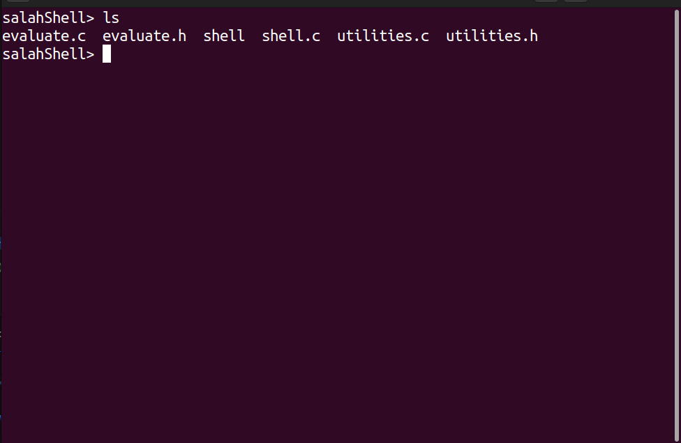
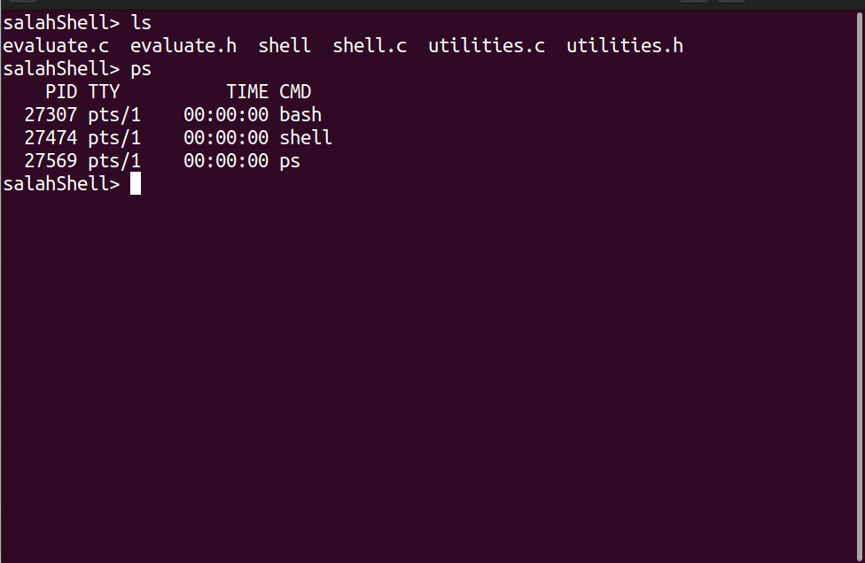

# Unix Shell
**A simple UNIX shell in C programming language**
## Requirements
- Linux environment
- C compiler ([gcc](https://www.geeksforgeeks.org/how-to-install-gcc-compiler-on-linux/))
- Text editor
## How to run
Open the terminal
```
cd directory_where_code_found
gcc -o shell shell.c utilities.c evaluate.c
./shell
```
## Screenshots


## Note
Although basic functionalities are implemented, some advanced functionalities are under development.

